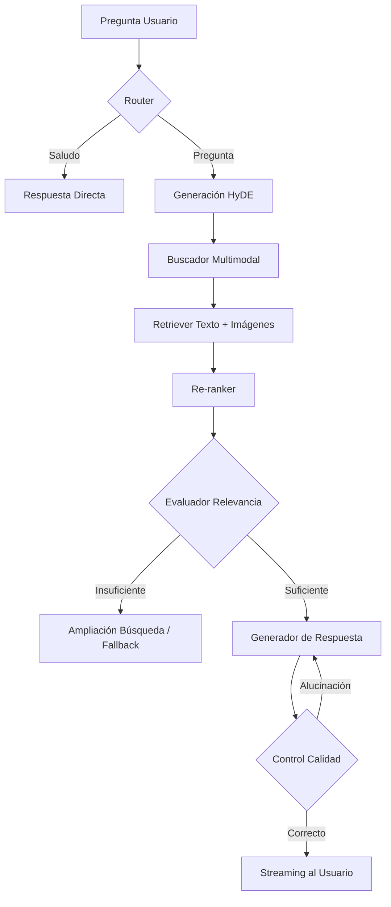

# ABA (Asistente Bizkaia Autónomos) - RAG Multimodal

Este proyecto implementa un sistema avanzado de **Generación Aumentada por Recuperación (RAG) Multimodal** diseñado para asistir a autónomos de Bizkaia. Utiliza una arquitectura basada en grafos para gestionar el flujo de conversación, recuperación de documentos (PDFs) e imágenes, y validación de respuestas.

## Características Principales

- **RAG Multimodal**: Recuperación inteligente tanto de fragmentos de texto como de imágenes relevantes extraídos de documentos técnicos.
- **Flujo Basado en Grafos**: Implementado con **LangGraph** para una lógica de decisión robusta (enrutamiento de consultas, evaluación de calidad, reintento de búsqueda).
- **Interfaz**: Frontend desarrollado con **Streamlit**, optimizado para una experiencia de usuario fluida y visualmente atractiva.
- **Backend**: API construida con **FastAPI** que gestiona el procesamiento, la búsqueda vectorial y el streaming de respuestas.
- **Búsqueda Híbrida y HyDE**: Mejora la recuperación mediante la generación de respuestas hipotéticas (HyDE) y re-ranking de resultados.
- **Evaluación Integrada**: Cálculo automático de métricas de retrieval (Hit Rate, MRR) y métricas de generación (Fidelidad, Relevancia).

---

## Estructura del Proyecto

```text
RAG/
├── chromadb/                           # Base de datos vectorial
├── data/                               # Documentos originales y metadatos procesados
│   ├── documentos/                     # PDFs originales
│   ├── metadata_pdf.json               # Metadatos extraídos de PDFs
│   └── metadata_imagenes.json          # Metadatos de imágenes procesadas
├── src/                                # Código fuente
│   ├── api/                            # Backend FastAPI y lógica del Grafo (LangGraph)
│   │   └── api.py                      # Definición de nodos, bordes y endpoints de la API
│   ├── ui/                             # Frontend Streamlit
│   │   └── interfaz.py                 # Componentes visuales y lógica de cliente
│   └── utilidades/                     # Funciones modulares de soporte
│       ├── funciones_db.py             # Gestión de ChromaDB (inserción, carga)
│       ├── funciones_preprocesado.py   # OCR, extracción de texto e imágenes
│       ├── funciones_evaluacion.py     # Lógica de métricas RAGAS/custom
│       ├── prompts.py                  # Plantillas de sistema para el LLM
│       └── utils.py                    # Utilidades generales del proyecto
├── run.py                              # Script principal para arrancar API + UI simultáneamente
├── requirements.txt                    # Dependencias del proyecto
└── .env.template                       # Configuración de claves API y rutas
```

---

## Esquema de Ejecución (RAG Flow)

El siguiente diagrama muestra cómo fluye una pregunta a través del sistema utilizando LangGraph:



---

## Cómo Empezar

### 1. Requisitos Previos
- Python 3.10 o superior.

### 2. Instalación
Clona el repositorio e instala las dependencias:
```bash
git clone https://github.com/iratisimon/aba-rag.git
cd RAG
pip install -r requirements.txt
```

### 3. Configuración de entorno
Crea un archivo ```.env``` y configúralo usando como base el archivo ```.env.template```:<br>
Lo único importante que deberías poner es una **API key** de [**groq**](groq.com).<br>
(Las demás variables están configuradas por defecto, pero puedes cambiarlas si quieres experimentar)

### 4. Preparación de Datos
Para procesar los PDFs y crear la base de datos vectorial:<br>
(El repositorio ya viene con una base de datos como ejemplo creada)
```bash
python src/utilidades/funciones_db.py
```

### 5. Ejecución
El proyecto incluye un script unificado que arranca la API de FastAPI y la interfaz de Streamlit automáticamente:
```bash
python run.py
```

---

## Tecnologías Utilizadas

- **Modelos**: GPT (OpenAI) / Claude (Anthropic), CLIP (Multimodal), Sentence Transformers.
- **Orquestación**: [LangGraph](https://www.langchain.com/langgraph) para flujos de control.
- **Base de Datos**: [ChromaDB](https://www.trychroma.com/) para almacenamiento vectorial.
- **Backend**: [FastAPI](https://fastapi.tiangolo.com/).
- **Frontend**: [Streamlit](https://streamlit.io/).
- **Procesamiento de Docs**: PyMuPDF para extracción de contenido.

---

## Visualización de ejemplo
<div align="center">
  <i>Página de inicio:</i>
  <br><br>
  
</div>

<br>

<div align="center">
  <i>Flujo de ejecución:</i>
  <br><br>
  
</div>

<br>

<div align="center">
  <i>Apartado de flujo de acciones/evaluación:</i>
  <br><br>
  
</div>
