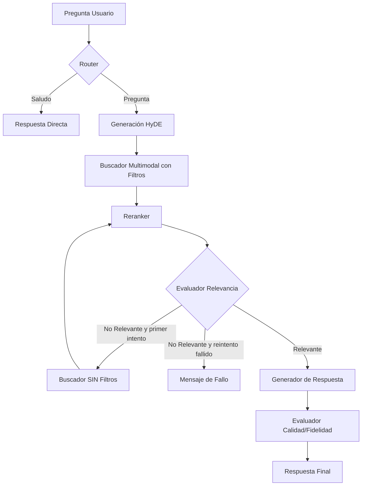

# ABA (Asistente Bizkaia Autónomos) - RAG Multimodal

Este proyecto implementa un sistema avanzado de Generación Aumentada por Recuperación (RAG) Multimodal diseñado para asistir a autónomos de Bizkaia. Utiliza una arquitectura basada en grafos para gestionar el flujo de conversación, recuperación de documentos (PDFs) e imágenes, y validación de respuestas.

## Objetivo

ABA (Asistente Bizkaia Autónomos) está orientado a apoyar a los trabajadores autónomos de Bizkaia en la resolución de dudas sobre trámites, normativa y ayudas, con el objetivo de facilitar la búsqueda de este tipo información y hacerla un poco más accesible. 

El contenido de los PDFs, se organiza en tres categorías principales: laboral, fiscal y ayudas y subvenciones. A partir de estos documentos se extraen las imágenes que el sistema utiliza como parte del proceso de recuperación multimodal.

## Características Principales

- **RAG Multimodal**: Recuperación inteligente tanto de fragmentos de texto como de imágenes relevantes.
- **Flujo Basado en Grafos**: Implementado con **LangGraph** para una lógica de decisión robusta (enrutamiento de consultas, evaluación de calidad, reintento de búsqueda sin filtros).
- **Interfaz**: Frontend desarrollado con **Streamlit**, optimizado para una experiencia de usuario fluida y visualmente atractiva con estados de carga claros.
- **Backend**: API construida con **FastAPI** que gestiona el procesamiento, la búsqueda vectorial y la orquestación de modelos.
- **Búsqueda Híbrida y HyDE**: Mejora la recuperación mediante la generación de respuestas hipotéticas (HyDE) y re-ranking de resultados con Cross-Encoders.
- **Lógica de Reintento**: Si el sistema no encuentra información relevante en la categoría seleccionada, realiza un segundo intento de búsqueda global sin filtros.
- **Evaluación Integrada**: Cálculo automático de métricas de retrieval (Hit Rate, MRR) y métricas de generación (Fidelidad, Relevancia).

---

## Estructura del Proyecto

```text
aba_rag/
├── chromadb/                           # Base de datos vectorial (ChromaDB)
├── data/                               # Documentos originales y metadatos procesados
│   ├── documentos/                     # PDFs originales e imágenes extraídas
│   ├── metadata_pdf.json               # Metadatos extraídos de PDFs (clave: category)
│   └── metadata_imagenes.json          # Metadatos de imágenes procesadas (clave: categoria)
├── src/                                # Código fuente
│   ├── api/                            # Backend FastAPI y lógica del Grafo (LangGraph)
│   │   └── api.py                      # Definición de nodos, bordes y endpoints de la API
│   ├── ui/                             # Frontend Streamlit
│   │   └── interfaz.py                 # Componentes visuales y lógica de cliente
│   └── utilidades/                     # Funciones modulares de soporte
│       ├── funciones_db.py             # Gestión de ChromaDB (inserción, carga)
│       ├── funciones_preprocesado.py   # OCR, extracción de texto e imágenes
│       ├── funciones_evaluacion.py     # Lógica de métricas RAG
│       ├── funciones_umap.py           # Visualización de embeddings con UMAP
│       ├── prompts.py                  # Plantillas de sistema para el LLM
│       └── utils.py                    # Utilidades generales del proyecto
├── visualizaciones_umap/               # Carpeta para visualizaciones UMAP generadas
│   └── umap_ABA_3d_categoria.html      # Proyección de embeddings en 3D por categoría
├── run.py                              # Script principal para arrancar API + UI simultáneamente
├── requirements.txt                    # Dependencias del proyecto
└── .env.template                       # Configuración de claves API y rutas
```

---

## Esquema de Ejecución (LangGraph Flow)

El siguiente diagrama muestra cómo fluye una consulta a través del sistema, incluyendo la lógica de reintento automático:



---

## Cómo Empezar

### 1. Requisitos Previos
- Python 3.10 o superior.

### 2. Instalación
Clona el repositorio e instala las dependencias:
```bash
git clone https://github.com/iratisimon/aba-rag.git
cd aba-rag
pip install -r requirements.txt
```

### 3. Configuración de Entorno
Crea un archivo .env y configuralo usando como base el archivo .env.template.
Es necesario configurar la API key de el proveedor de LLM compatible con OpenAI (ej: Groq).

### 4. Preparación de Datos
Para procesar los PDFs y crear la base de datos vectorial:
```bash
python src/utilidades/funciones_db.py
```

### 5. Ejecución
El proyecto incluye un script unificado que arranca la API de FastAPI y la interfaz de Streamlit automáticamente:
```bash
python run.py
```

---

## Tecnologías Utilizadas

- **Modelos**: LLM compatible con OpenAI (GPT, Llama), CLIP (Multimodal), Sentence Transformers (BGE), Cross-Encoders (Re-ranking).
- **Orquestación**: LangGraph para la gestión de estados y flujos complejos.
- **Base de Datos**: ChromaDB para almacenamiento vectorial distribuido por colecciones (PDFs/Imágenes).
- **Backend**: FastAPI para la exposición de servicios y procesamiento asíncrono.
- **Frontend**: Streamlit para la interfaz de usuario con componentes personalizados.
- **Procesamiento de Docs**: PyMuPDF para extracción, UMAP para análisis de clusters.

---

## Visualización de ejemplo
<div align="center">
  <i>Página de inicio:</i>
  <br><br>
  
</div>

<br>

<div align="center">
  <i>Flujo de ejecución:</i>
  <br><br>
  
</div>

<br>

<div align="center">
  <i>Apartado de flujo de acciones/evaluación:</i>
  <br><br>
  
</div>
