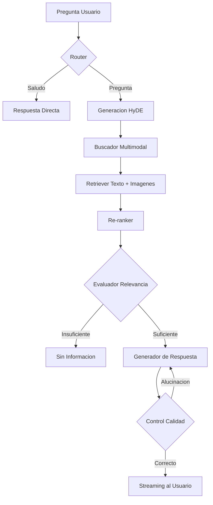

# ABA (Asistente Bizkaia Autonomos) - RAG Multimodal

Este proyecto implementa un sistema avanzado de Generacion Aumentada por Recuperacion (RAG) Multimodal disenado para asistir a autonomos de Bizkaia. Utiliza una arquitectura basada en grafos para gestionar el flujo de conversacion, recuperacion de documentos (PDFs) e imagenes, y validacion de respuestas.

## Caracteristicas Principales

- **RAG Multimodal**: Recuperacion inteligente tanto de fragmentos de texto como de imagenes relevantes (graficos, tablas, logos) extraidos de documentos tecnicos.
- **Flujo Basado en Grafos**: Implementado con **LangGraph** para una logica de decision robusta (enrutamiento de consultas, evaluacion de calidad, reintento de busqueda).
- **Interfaz**: Frontend desarrollado con **Streamlit**, optimizado para una experiencia de usuario fluida y visualmente atractiva.
- **Backend**: API construida con **FastAPI** que gestiona el procesamiento, la busqueda vectorial y el streaming de respuestas.
- **Busqueda Hibrida y HyDE**: Mejora la recuperacion mediante la generacion de respuestas hipoteticas (HyDE) y re-ranking de resultados con Cross-Encoders.
- **Evaluacion Integrada**: Calculo automatico de metricas de retrieval (Hit Rate, MRR) y metricas de generacion (Fidelidad, Relevancia).
- **Visualizacion UMAP**: Herramienta para el analisis espacial de los embeddings proyectados en 2D y 3D.

---

## Estructura del Proyecto

```text
aba_rag/
├── chromadb/                           # Base de datos vectorial
├── data/                               # Documentos originales y metadatos procesados
│   ├── documentos/                     # PDFs originales e imagenes extraidas
│   ├── metadata_pdf.json               # Metadatos extraidos de PDFs (clave: category)
│   └── metadata_imagenes.json          # Metadatos de imagenes procesadas (clave: categoria)
├── src/                                # Codigo fuente
│   ├── api/                            # Backend FastAPI y logica del Grafo (LangGraph)
│   │   └── api.py                      # Definicion de nodos, bordes y endpoints de la API
│   ├── ui/                             # Frontend Streamlit
│   │   └── interfaz.py                 # Componentes visuales y logica de cliente
│   └── utilidades/                     # Funciones modulares de soporte
│       ├── funciones_db.py             # Gestion de ChromaDB (insercion, carga)
│       ├── funciones_preprocesado.py   # OCR, extraccion de texto e imagenes
│       ├── funciones_evaluacion.py     # Logica de metricas RAG
│       ├── funciones_umap.py           # Visualizacion de embeddings con UMAP
│       ├── prompts.py                  # Plantillas de sistema para el LLM
│       └── utils.py                    # Utilidades generales del proyecto
├── visualizaciones_umap/               # Carpeta para visualizaciones umap
│   └──umap_ABA_3d_categoria.html       # Archivo .html con los graficos mostrando la distribución de los embbedings
├── run.py                              # Script principal para arrancar API + UI simultaneamente
├── requirements.txt                    # Dependencias del proyecto
└── .env.template                       # Configuracion de claves API y rutas
```

---

## Esquema de Ejecucion (RAG Flow)

El siguiente diagrama muestra cono fluye una pregunta a traves del sistema utilizando LangGraph:



---

## Como Empezar

### 1. Requisitos Previos
- Python 3.10 o superior.

### 2. Instalacion
Clona el repositorio e instala las dependencias:
```bash
git clone https://github.com/iratisimon/aba-rag.git
cd aba-rag
pip install -r requirements.txt
```

### 3. Configuracion de entorno
Crea un archivo .env y configuralo usando como base el archivo .env.template.
Es necesario configurar la API key de el proveedor de LLM compatible con OpenAI (ej: Groq).

### 4. Preparacion de Datos
Para procesar los PDFs y crear la base de datos vectorial:
```bash
python src/utilidades/funciones_db.py
```

### 5. Ejecucion
El proyecto incluye un script unificado que arranca la API de FastAPI y la interfaz de Streamlit automaticamente:
```bash
python run.py
```

---

## Tecnologias Utilizadas

- **Modelos**: LLM compatible con OpenAI (GPT, Llama), CLIP (Multimodal), Sentence Transformers (BGE).
- **Orquestacion**: LangGraph para flujos de control y grafos de estado.
- **Base de Datos**: ChromaDB para almacenamiento vectorial.
- **Backend**: FastAPI para la exposicion de servicios y streaming.
- **Frontend**: Streamlit para la interfaz de usuario.
- **Procesamiento de Docs**: PyMuPDF para la extraccion de contenido y UMAP para visualizacion.

---

## Visualizacion de ejemplo
<div align="center">
  <i>Pagina de inicio:</i>
  <br><br>
  
</div>

<br>

<div align="center">
  <i>Flujo de ejecucion:</i>
  <br><br>
  
</div>

<br>

<div align="center">
  <i>Apartado de flujo de acciones/evaluacion:</i>
  <br><br>
  
</div>
